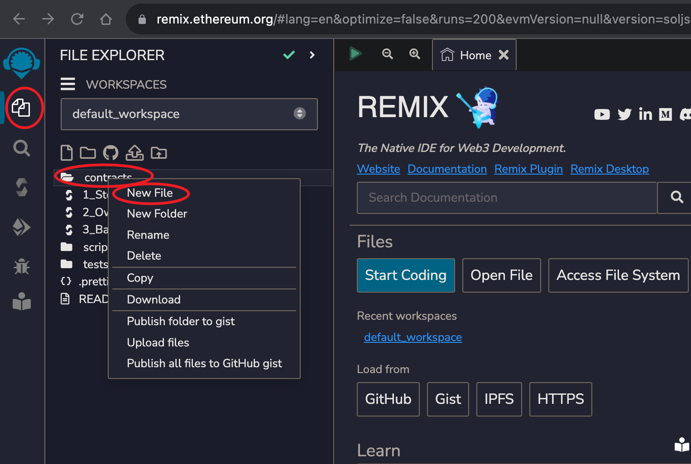
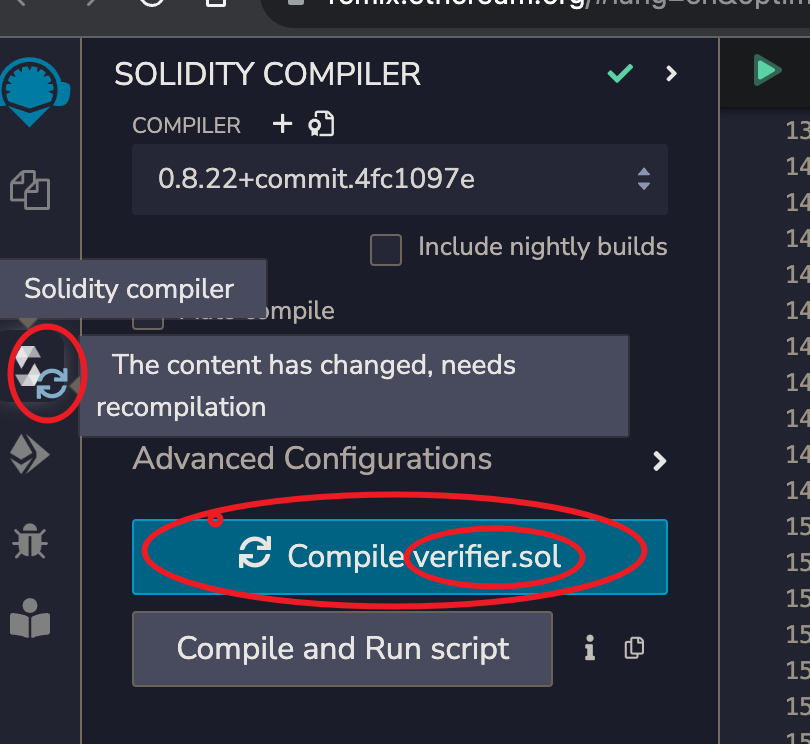

## Circom 电路描述语言 和 零知识证明(ZKProof) 学习记录

Circom 的文档链接: [官方文档](https://docs.circom.io/)

其他文章:

[<==和<--的区别(赋值了为什么还需要约束)](https://github.com/0xPARC/zk-bug-tracker#8-assigned-but-not-constrained)

[一篇很不错的科普](https://medium.com/@VitalikButerin/quadratic-arithmetic-programs-from-zero-to-hero-f6d558cea649#5539)

---

### 搭建 Circom 开发环境

- 安装 rustup

  ```shell
  curl --proto '=https' --tlsv1.2 https://sh.rustup.rs -sSf | sh
  ```

- 安装 node.js 和 npm, yarn 等包管理工具

- clone circom git

  ```shell
  git clone https://github.com/iden3/circom.git
  ```

- 用 rust 的编译工具 cargo 编译 circom

  ```shell
  cd circom
  cargo build --release
  ```

- 安装 circom

  ```shell
  cargo install --path circom
  ```

- 运行 circom -h 看看是否安装成功

  ```shell
  circom -h
  circom compiler 2.1.7
  IDEN3
  Compiler for the circom programming language


  USAGE:
  circom [FLAGS] [OPTIONS] [--] [input]

  FLAGS:
  --r1cs Outputs the constraints in r1cs format
  --sym Outputs witness in sym format
  --wasm Compiles the circuit to wasm
  --json Outputs the constraints in json format
  --wat Compiles the circuit to wat
  -c, --c Compiles the circuit to c
  --O0 No simplification is applied
  --O1 Only applies var to var and var to constant   simplification
  --O2 Full constraint simplification
  --verbose Shows logs during compilation
  --inspect Does an additional check over the constraints   produced
  --use_old_simplification_heuristics Applies the old   version of the heuristics when performing linear
  simplification
  --simplification_substitution Outputs the substitution in   json format
  -h, --help Prints help information
  -V, --version Prints version information

  OPTIONS:
  -o, --output <output> Path to the directory where the   output will be written [default: .]
  -p, --prime <prime> To choose the prime number to use to   generate the circuit. Receives the
  name of the curve (bn128, bls12381, goldilocks, grumpkin,   pallas, vesta)
  [default: bn128]
  -l <link_libraries>... Adds directory to library search   path
  --O2round <simplification_rounds> Maximum number of   rounds of the simplification process

  ARGS:
  <input> Path to a circuit with a main component   [default: ./circuit.circom]
  ```

- 安装 snarkjs

  ```shell
  npm install -g snarkjs
  ```

  snarkjs 可以从 circom 产出的文件中生成和验证 ZKProof(零知识证明)。也可以输出对应的 solidity 代码，用于部署到以太坊上完成验证 ZKProof 的工作。

- 关于开发环境
  VSCode 里有一些 extension, 从下载数看用的人不多。

  如果有适合 Circom 的 extension, 请告诉我

### 编写 Circom 代码

新建一个名为 `AgeProof.circom` 的文件, 内容如下:

```circom
pragma circom 2.0.0;


function nbits(a) {
    var n = 1;
    var r = 0;
    while (n-1<a) {
        r++;
        n *= 2;
    }
    return r;
}


template BinSum(n, ops) {
    var nout = nbits((2**n -1)*ops);
    signal input in[ops][n];
    signal output out[nout];

    var lin = 0;
    var lout = 0;

    var k;
    var j;

    var e2;

    e2 = 1;
    for (k=0; k<n; k++) {
        for (j=0; j<ops; j++) {
            lin += in[j][k] * e2;
        }
        e2 = e2 + e2;
    }

    e2 = 1;
    for (k=0; k<nout; k++) {
        out[k] <-- (lin >> k) & 1;

        // Ensure out is binary
        out[k] * (out[k] - 1) === 0;

        lout += out[k] * e2;

        e2 = e2+e2;
    }

    // Ensure the sum;

    lin === lout;
}

template IsZero() {
    signal input in;
    signal output out;

    signal inv;

    inv <-- in!=0 ? 1/in : 0;

    out <== -in*inv +1;
    in*out === 0;
}

template Num2BitsNeg(n) {
    signal input in;
    signal output out[n];
    var lc1=0;

    component isZero;

    isZero = IsZero();

    var neg = n == 0 ? 0 : 2**n - in;

    for (var i = 0; i<n; i++) {
        out[i] <-- (neg >> i) & 1;
        out[i] * (out[i] -1 ) === 0;
        lc1 += out[i] * 2**i;
    }

    in ==> isZero.in;


    lc1 + isZero.out * 2**n === 2**n - in;
}

template Num2Bits(n) {
    signal input in;
    signal output out[n];
    var lc1=0;

    var e2=1;
    for (var i = 0; i<n; i++) {
        out[i] <-- (in >> i) & 1;
        out[i] * (out[i] -1 ) === 0;
        lc1 += out[i] * e2;
        e2 = e2+e2;
    }

    lc1 === in;
}

template LessThan(n) {
    signal input in[2];
    signal output out;

    component num2Bits0;
    component num2Bits1;

    component adder;

    adder = BinSum(n, 2);

    num2Bits0 = Num2Bits(n);
    num2Bits1 = Num2BitsNeg(n);

    in[0] ==> num2Bits0.in;
    in[1] ==> num2Bits1.in;

    var i;
    for (i=0;i<n;i++) {
        num2Bits0.out[i] ==> adder.in[0][i];
        num2Bits1.out[i] ==> adder.in[1][i];
    }

    adder.out[n-1] ==> out;
}

template AgeProof() {
  signal input age;
  signal input ageLimit;
  signal output out;

  component lt = LessThan(32);
  lt.in[0] <== ageLimit;
  lt.in[1] <== age;
  out <== lt.out;
}

component main {public[ageLimit]} = AgeProof();

```

这个文件演示了用零知识证明来证明一个人的年龄是否大于某个年龄限制，并且不泄露此人的具体年龄。

LessThan 会把 in[0]和 in[1]的大小比较输出为 0 或者 1, 同时只有 ageLimit 为 public 的。

这样 verifier 可以知道 prover 声明的年龄是否大于 ageLimit，但是不知道 prover 的 age。

(需要说明的是，这个例子可能存在一些 Bug，主要只是为了说明 Circom 的使用方法)

### 编译 AgeProof.circom

```shell
circom AgeProof.circom --r1cs --wasm --sym --c
```

相关的参数含义见[链接](https://docs.circom.io/getting-started/compiling-circuits/)

输出信息为

```shell

template instances: 6
non-linear constraints: 99
linear constraints: 0
public inputs: 1
private inputs: 1
public outputs: 1
wires: 99
labels: 173
Written successfully: ./AgeProof.r1cs
Written successfully: ./AgeProof.sym
Written successfully: ./AgeProof_cpp/AgeProof.cpp and ./AgeProof_cpp/AgeProof.dat
Written successfully: ./AgeProof_cpp/main.cpp, circom.hpp, calcwit.hpp, calcwit.cpp, fr.hpp, fr.cpp, fr.asm and Makefile
Written successfully: ./AgeProof_js/AgeProof.wasm
Everything went okay
```

运行完成后会生成 AgeProof_js 和 AgeProof_cpp 两个目录

- 编译 witness

  ZKProof 的验证方只会对 circom 的约束进行验证，不会进行赋值操作。

  所以是由 prover 来生成 witness，然后由 verifier 来验证。
  (同一个 signal 只能被赋值一次，所以 prover 不能恶意修改电路代码来试图对 signal 进行多次赋值，绕开 verifier 的验证)

  The set of inputs, intermediate signals and output is called witness.

  #### 在 AgeProof_js 目录下创建一个 `input.json`, 内容如下

  ```json
  { "age": 21, "ageLimit": 18 }
  ```

  #### 然后运行如下命令

  ```shell
  node generate_witness.js AgeProof.wasm input.json witness.wtns
  ```

  #### 确认目录下生成了 `witness.wtns` 文件

---

### 使用 `snarkjs` 生成 ZKProof 的密钥文件

- 步骤 1: 生成 [Powers of Tau](https://github.com/ebfull/powersoftau)

  此步骤与我们刚才生成的电路无关。

  #### 在 `AgeProof_js` 目录下运行命令

  ```shell
  snarkjs powersoftau new bn128 12 pot12_0000.ptau -v
  ```

  输出为

  ```shell
  [DEBUG] snarkJS: Calculating First Challenge Hash
  [DEBUG] snarkJS: Calculate Initial Hash: tauG1
  [DEBUG] snarkJS: Calculate Initial Hash: tauG2
  [DEBUG] snarkJS: Calculate Initial Hash: alphaTauG1
  [DEBUG] snarkJS: Calculate Initial Hash: betaTauG1
  [DEBUG] snarkJS: Blank Contribution Hash:
                  786a02f7 42015903 c6c6fd85 2552d272
                  912f4740 e1584761 8a86e217 f71f5419
                  d25e1031 afee5853 13896444 934eb04b
                  903a685b 1448b755 d56f701a fe9be2ce
  [INFO]  snarkJS: First Contribution Hash:
                  9e63a5f6 2b96538d aaed2372 481920d1
                  a40b9195 9ea38ef9 f5f6a303 3b886516
                  0710d067 c09d0961 5f928ea5 17bcdf49
                  ad75abd2 c8340b40 0e3b18e9 68b4ffef
  ```

  #### 接下来运行

  ```shell
  snarkjs powersoftau contribute pot12_0000.ptau pot12_0001.ptau --name="First contribution" -v
  ```

  #### 此时会提示输入一个 random text, 随便输入即可(无需记住)

  ```shell
  snarkjs powersoftau contribute pot12_0000.ptau pot12_0001.ptau --name="First contribution" -v
  Enter a random text. (Entropy):
  ```

  输出为

  ```shell
  [DEBUG] snarkJS: Calculating First Challenge Hash
  [DEBUG] snarkJS: Calculate Initial Hash: tauG1
  [DEBUG] snarkJS: Calculate Initial Hash: tauG2
  [DEBUG] snarkJS: Calculate Initial Hash: alphaTauG1
  [DEBUG] snarkJS: Calculate Initial Hash: betaTauG1
  [DEBUG] snarkJS: processing: tauG1: 0/8191
  [DEBUG] snarkJS: processing: tauG2: 0/4096
  [DEBUG] snarkJS: processing: alphaTauG1: 0/4096
  [DEBUG] snarkJS: processing: betaTauG1: 0/4096
  [DEBUG] snarkJS: processing: betaTauG2: 0/1
  [INFO]  snarkJS: Contribution Response Hash imported:
                8b8d0570 5cd60ffa 892781d1 9c1cc985
                6694465e 927ab2c9 3a59ab03 2491408b
                92de8800 be7802bb d1fd4135 e5972571
                b017bd99 2b2fb52d 942c0720 e3935a98
  [INFO]  snarkJS: Next Challenge Hash:
                ec411d53 2515a87a 9a215131 e6721e97
                6902d407 12bbfb5c e96f75cf 22202edc
                12a985e1 9bd62b3c 1b62f631 85b18241
                632faaf9 7b9070fe e93d3705 f9315bd5
  ```

- 步骤 2: 生成 [Powers of Tau](https://github.com/ebfull/powersoftau)

  使用步骤 1 的输出和前面生成的电路相关文件，生成用于证明和验证 ZKProof 的密钥文件。

  #### 在 `AgeProof_js` 目录下运行命令

  ```shell
  snarkjs powersoftau prepare phase2 pot12_0001.ptau pot12_final.ptau -v
  ```

  此命令执行时间相对较长, 输出也较多, 仅截取最后几行

  ```shell
  ...
  ...

  [DEBUG] snarkJS: betaTauG1: fft 12 join  10/12  4/4 0/1
  [DEBUG] snarkJS: betaTauG1: fft 12 join  10/12  3/4 0/1
  [DEBUG] snarkJS: betaTauG1: fft 12 join  10/12  1/4 0/1
  [DEBUG] snarkJS: betaTauG1: fft 12 join  10/12  2/4 0/1
  [DEBUG] snarkJS: betaTauG1: fft  12  join: 11/12
  [DEBUG] snarkJS: betaTauG1: fft 12 join  11/12  1/2 0/2
  [DEBUG] snarkJS: betaTauG1: fft 12 join  11/12  2/2 1/2
  [DEBUG] snarkJS: betaTauG1: fft 12 join  11/12  2/2 0/2
  [DEBUG] snarkJS: betaTauG1: fft 12 join  11/12  1/2 1/2
  [DEBUG] snarkJS: betaTauG1: fft  12  join: 12/12
  [DEBUG] snarkJS: betaTauG1: fft 12 join  12/12  1/1 1/4
  [DEBUG] snarkJS: betaTauG1: fft 12 join  12/12  1/1 3/4
  [DEBUG] snarkJS: betaTauG1: fft 12 join  12/12  1/1 0/4
  [DEBUG] snarkJS: betaTauG1: fft 12 join  12/12  1/1 2/4

  ```

  #### 执行如下命令, 生成 AgeProof_0000.zkey (用于 proving 和 verification 的 keys 之一)

  ```shell
  snarkjs groth16 setup ../AgeProof.r1cs pot12_final.ptau AgeProof_0000.zkey
  ```

  输出为

  ```shell
  [INFO]  snarkJS: Reading r1cs
  [INFO]  snarkJS: Reading tauG1
  [INFO]  snarkJS: Reading tauG2
  [INFO]  snarkJS: Reading alphatauG1
  [INFO]  snarkJS: Reading betatauG1
  [INFO]  snarkJS: Circuit hash:
                18219fc2 e14f9b4b 2e4f7ea6 73dcbdff
                f94846d9 3420d6c4 7a0572c8 c4bfd8e4
                1a3f70a9 31e89fbb 4b012ffc 8770c829
                c83a6553 3268c7ba c6a361a0 04c96a0b
  ```

  #### 执行如下命令，生成 AgeProof_0001.zkey

  ```shell
  snarkjs zkey contribute AgeProof_0000.zkey AgeProof_0001.zkey --name="1st Contributor Name" -v
  ```

  此时需要输入 random text, 随便输入即可, 不需要与前面步骤的随机文本相同。

  ```shell
  snarkjs zkey contribute AgeProof_0000.zkey AgeProof_0001.zkey --name="1st Contributor Name" -v
  Enter a random text. (Entropy):
  ```

  输出为

  ```shell
  [DEBUG] snarkJS: Applying key: L Section: 0/96
  [DEBUG] snarkJS: Applying key: H Section: 0/128
  [INFO]  snarkJS: Circuit Hash:
                18219fc2 e14f9b4b 2e4f7ea6 73dcbdff
                f94846d9 3420d6c4 7a0572c8 c4bfd8e4
                1a3f70a9 31e89fbb 4b012ffc 8770c829
                c83a6553 3268c7ba c6a361a0 04c96a0b
  [INFO]  snarkJS: Contribution Hash:
                276eb804 94dda181 74930256 16395d75
                99de7ced 8b13ddef 06e44355 17164971
                6ab7eed9 07b8ffd3 755f4cf4 ed099d59
                0fcf16dd f99de3d1 9bcb45f2 9cc8b744
  ```

  #### 执行如下命令, 导出用于验证的 key 文件 (`verification_key.json`)

  ```shell
  snarkjs zkey export verificationkey AgeProof_0001.zkey verification_key.json
  ```

  输出为

  ```shell
  [INFO]  snarkJS: EXPORT VERIFICATION KEY STARTED
  [INFO]  snarkJS: > Detected protocol: groth16
  [INFO]  snarkJS: EXPORT VERIFICATION KEY FINISHED
  ```

  #### `verifcation_key.json` 的内容如下

  ```json
  {
    "protocol": "groth16",
    "curve": "bn128",
    "nPublic": 2,
    "vk_alpha_1": [
      "16073850083200230952093279140226723900853487167940491823408406968308939177279",
      "17578802480331524046326831404364664315930448541093678176978880258054827625093",
      "1"
    ],
    "vk_beta_2": [
      [
        "20644093034487256140125760236031591846518605920454567523346978660619068131427",
        "17094376053438945506674042126889194151108854970828820336019406321689418385645"
      ],
      [
        "2423519831452382168528396311438318135697175575121112128602449517422489181005",
        "16717309186157922321857859380133080252654094151538936297280616526469043923211"
      ],
      ["1", "0"]
    ],
    "vk_gamma_2": [
      [
        "10857046999023057135944570762232829481370756359578518086990519993285655852781",
        "11559732032986387107991004021392285783925812861821192530917403151452391805634"
      ],
      [
        "8495653923123431417604973247489272438418190587263600148770280649306958101930",
        "4082367875863433681332203403145435568316851327593401208105741076214120093531"
      ],
      ["1", "0"]
    ],
    "vk_delta_2": [
      [
        "12034134609133471689966274524721926563590678877799935092236479876634911298408",
        "17782523871498620267021690573944238038088420129336988296621472032589192489274"
      ],
      [
        "18234482671723986830999350448600407986831322124825719874104567796078990179776",
        "12521618109894196109647610905304730067826669708823107155176640657793712713473"
      ],
      ["1", "0"]
    ],
    "vk_alphabeta_12": [
      [
        [
          "16839764207365673648379231054396022419590729798978991232001825364248060385065",
          "19591304315706166818510480941387147923497691773187996731198341935677231045458"
        ],
        [
          "6081368412425816528139330862654174482287387206991753501453036019097068467054",
          "7991800187267388237290781605089493974078542064604278039032167787496837446985"
        ],
        [
          "2039527720373147390814378143063289250421205976872691194988518911309147475660",
          "4558647917475499523647689970851197865849615501854048903365902925379748352149"
        ]
      ],
      [
        [
          "2285571884332412631967574846380959394631412029120355583421952944834176739321",
          "6393782075152243340595958118062939788589074497695662503603859052049252908509"
        ],
        [
          "4878037314098668981419682538535282775193605998924148620145066150357372133549",
          "10757668243385574718208881192801626692277965967887357840214880229893311920460"
        ],
        [
          "2669511307876742027896465864473109932175333906667052083773380770338717434123",
          "17628873663284020780355415641554466088206986774802497595626069624330407384247"
        ]
      ]
    ],
    "IC": [
      [
        "18875726799687913300217593290817614418425875692624709881622429782005182494772",
        "3325018129137523052585125532249459664137013124021247304150195982613998479750",
        "1"
      ],
      [
        "6334949881924552874728377073398949183579985379539369003992359699796343209334",
        "10791227853808711073226479455169875257571158615503974506836664393794308693799",
        "1"
      ],
      [
        "16785982869348851179196486145319007628875437527705604372533821268549218651122",
        "9725242544800025160078531737811653887969808531861229611600987953107483625710",
        "1"
      ]
    ]
  }
  ```

---

### 生成 ZKProof

在 `AgeProof_js` 目录下运行命令

```shell
snarkjs groth16 prove AgeProof_0001.zkey witness.wtns proof.json public.json
```

此命令会生成 groth16 proof, 一共有两个输出文件

- `proof.json`

  此文件包含了 proof 的内容

  ```json
  {
    "pi_a": [
      "8103389419413220673446704511813368756454588519269968576507934663688475353284",
      "11018646634240269268083040692600683394773910861175806293546670727327651464516",
      "1"
    ],
    "pi_b": [
      [
        "17758609319340177489056115589100963110252806240842125236424219934996818517524",
        "9573547542160242905612314187421544203206445701846002224982996230898835177197"
      ],
      [
        "21085180962888507567397278791124909827581061940773556820111202903659661499455",
        "12393611283254155006135220871838960360026380266375635870540868148193215547506"
      ],
      ["1", "0"]
    ],
    "pi_c": [
      "11310420531980561852872820169871096574930359628445867989027557342544636622717",
      "5465233469562572978168549004823804298803908551604625705098468166419584060105",
      "1"
    ],
    "protocol": "groth16",
    "curve": "bn128"
  }
  ```

- `public.json`

  此文件包含了 电路的 output signal 的值，以及 public input singal 的值

  ```json
  ["1", "18"]
  ```

  其中的"1"为电路中 LessThan 的结果， "18"为 ageLimit 的值，表示电路里输入的年龄比 18 要大。

  如果将前面 `input.json` 改动为如下内容，并重新执行以上各步骤。

  ```json
  { "age": 16, "ageLimit": 18 }
  ```

  `public.json`的内容将会是

  ```json
  ["0", "18"]
  ```

  <span style="color: #00AAAA;">
  在实际使用时 private input age 会和其他数据一起在 zkproof 中被其他公私钥对签名, 以确保不会被篡改。

  这样可以避免 prover 随意输入自己的 age 就能通过 verifier 验证的情况。

  详见后续的 DID 相关学习记录。
  </span>

### 验证 ZKProof

prover 可以将前面生成的 `verification_key.json` `public.json` `proof.json` 文件一并发送给 verifier。

verifier 执行如下命令来验证

```shell
snarkjs groth16 verify verification_key.json public.json proof.json
```

```shell
[INFO]  snarkJS: OK!
```

如果 prover 修改了几个 json 中的任意内容，验证将会失败。

```shell
snarkjs groth16 verify verification_key.json public.json proof.json
[ERROR] snarkJS: Invalid proof
```

---

### 通过智能合约验证 ZKProof

- 生成 verifier solidity 代码

  运行如下命令

  ```shell
  snarkjs zkey export solidityverifier AgeProof_0001.zkey verifier.sol
  ```

  输出为

  ```shell
  [INFO]  snarkJS: EXPORT VERIFICATION KEY STARTED
  [INFO]  snarkJS: > Detected protocol: groth16
  [INFO]  snarkJS: EXPORT VERIFICATION KEY FINISHED
  ```

  同时会生成 `verifier.sol` 文件

- 部署合约代码

  - 浏览器访问 [https://remix.ethereum.org/](https://remix.ethereum.org/)

  - 点击最左边 Tab 栏的 `File explorer`, 然后在 contracts 目录上点击右键，选择新建文件，命名为`verifier.sol`

    

  - 选中刚创建的 `verifier.sol` 文件, 将本地的同名文件内容复制到浏览器页面右侧的编辑框中

  - 点击最左边 Tab 栏的 `Solidity compiler`，然后点击`Compile verifier.sol`

  
